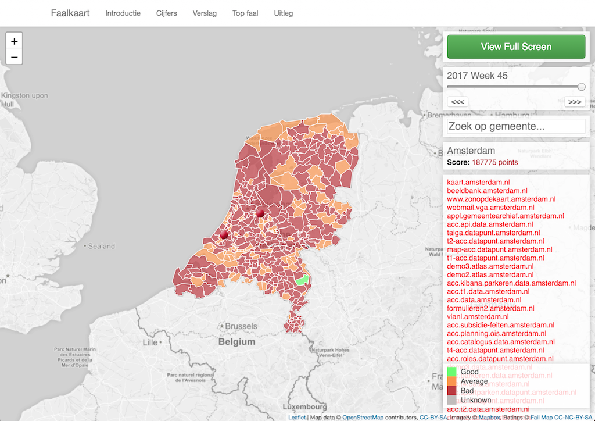

  
 

Why Failmap
===========
We believe privacy and information integrity are the basics of a resilient information society.

By providing unprecedented transparency on the most basic levels of information security, insight in
the quality and capability of organizations regarding their responsibilities is displayed.

Failmap uses the complexity of a traffic light anyone is able to determine if organizations that are responsible
for safeguarding information are doing what they are supposed to do.

It is perfectly possible to run Failmap software for yourself, allowing you to independently verify the
state of information security basics. All our products are open source.

What is it
----------
Failmap is an open source web application that continuously evaluates the implementation of security standards and
best practices at (governmental) organizations.

This repository contains the mapping application fo Failmap: the public frontend, an administrative interface and scanners.

Getting started
===============
Keywords: quickstart, installation

System requirements
-------------------

Linux or MacOS capable of running Python3 and git.

Software Requirements
---------------------

Download and install below system requirements to get started:

- [git](https://git-scm.com/downloads) (download and install)
- [python3.6](https://www.python.org/downloads/) (download and install)
- [Tox](http://tox.readthedocs.io/) (`pip3 install --user tox`)
- [direnv](https://direnv.net/) (download and install, then follow [setup instructions](https://direnv.net/), see Direnv section below)
- [Docker](https://docs.docker.com/engine/installation/) (recommended, follow instructions to install.)

Quickstart
----------

In a directory of your choosing:

    # download the software
    git clone --recursive https://gitlab.com/failmap/failmap/

    # enter the directory of the downloaded software
    cd failmap/

Using Direnv & Tox to manage environment (see Direnv section below). This prepares the shell environment for local development.

    direnv allow

Running Tox once creates a development Virtualenv in `.tox/default/` which is automatically used after creation due to Direnv setup. Running Tox without arguments by default also runs basic checks and tests to verify project code quality.

    tox

After completing succesfully the application is available to run:

    failmap -h

The following commands will start a complete developer instance of failmap with all required services.

    failmap devserver

Now visit the [map website](http://127.0.0.1:8000/) and/or the
[admin website](http://127.0.0.1:8000/admin/) at http://127.0.0.1:8000 (credentials: admin:faalkaart).

Documentation
=============
Documentation is provided at [ReadTheDocs](http://failmap.readthedocs.io/).

Get involved
============

Failmap is open organisation run by volunteers.

- Talk to us via [gitter.im/internet-cleanup-foundation](https://gitter.im/internet-cleanup-foundation/Lobby#).
- E-mail us at: [info@faalkaart.nl](mailto:info@faalkaart.nl),
- Or simply start hacking on the code, open an [Gitlab Issue](https://gitlab.com/failmap/failmap/issues/new) or send a [Gitlab Merge Request](https://gitlab.com/failmap/failmap.org/merge_requests/new).

Thanks to
=========
This project is being maintained by the [Internet Cleanup Foundation](https://internetcleanup.foundation).
Special thanks to the SIDN Fonds for believing in this method of improving privacy.

Thanks to the many authors contributing to open software.
