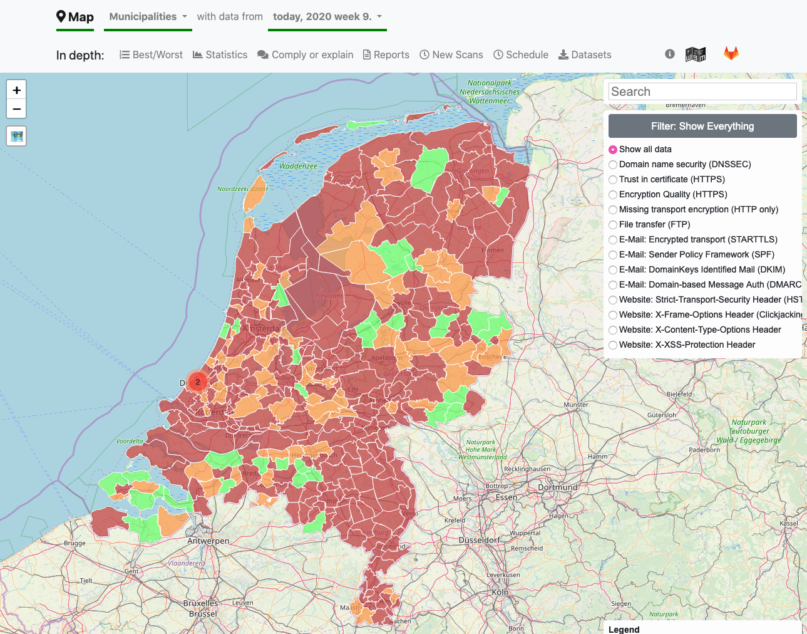
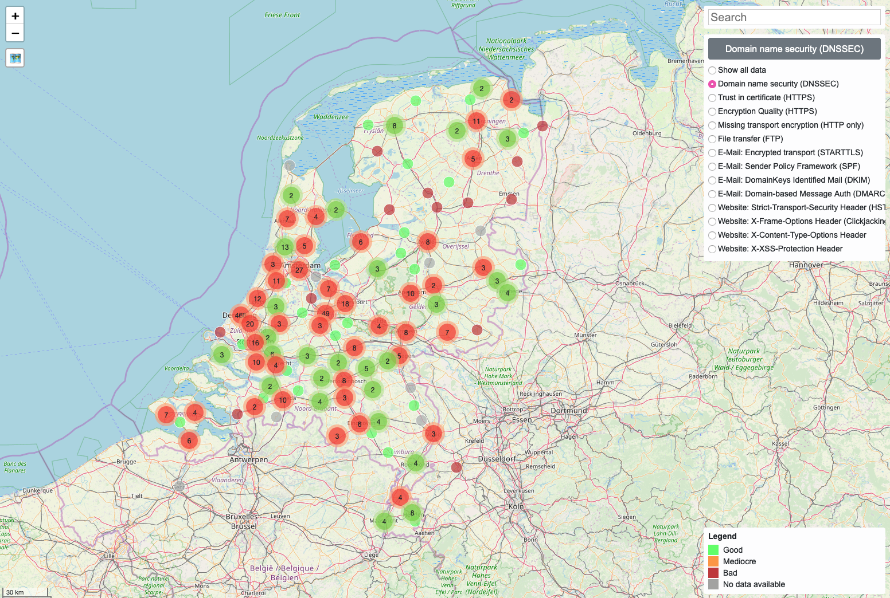
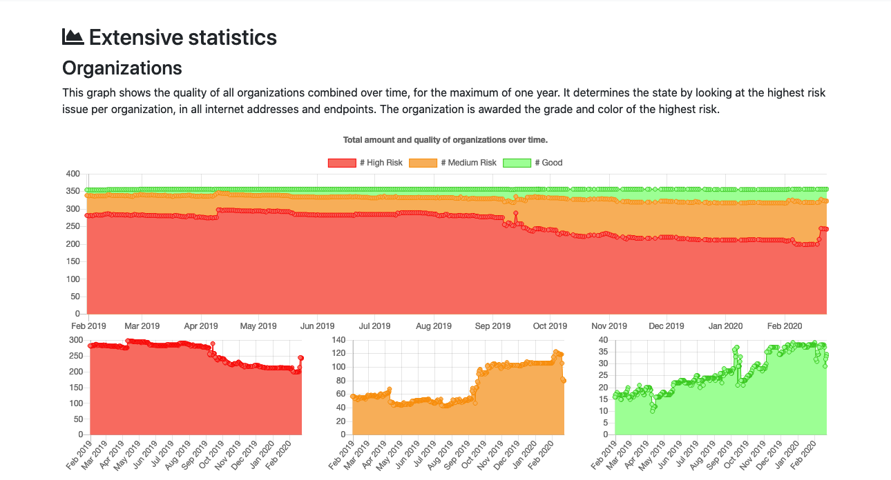
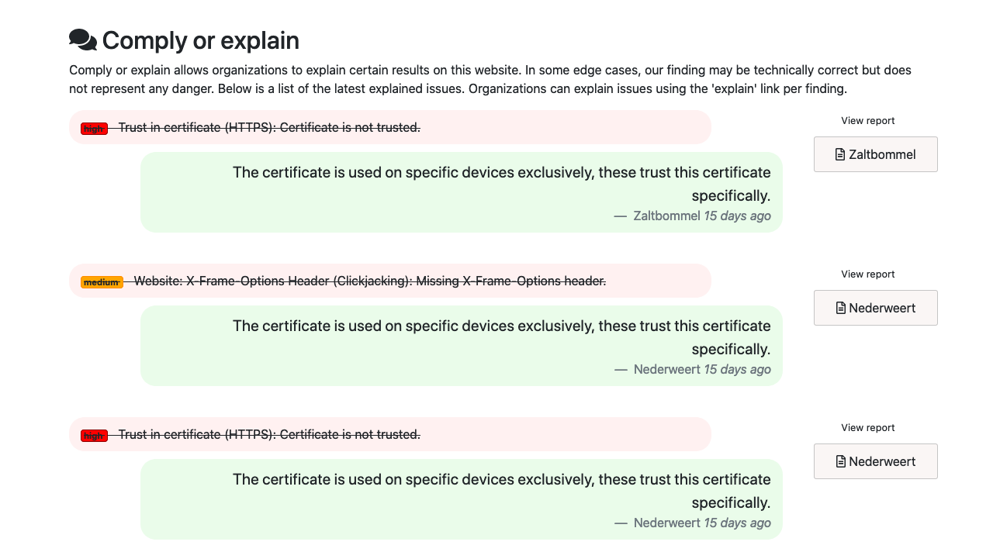
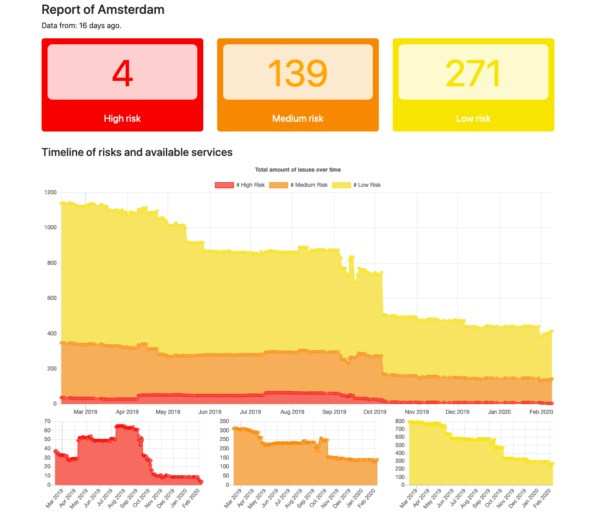
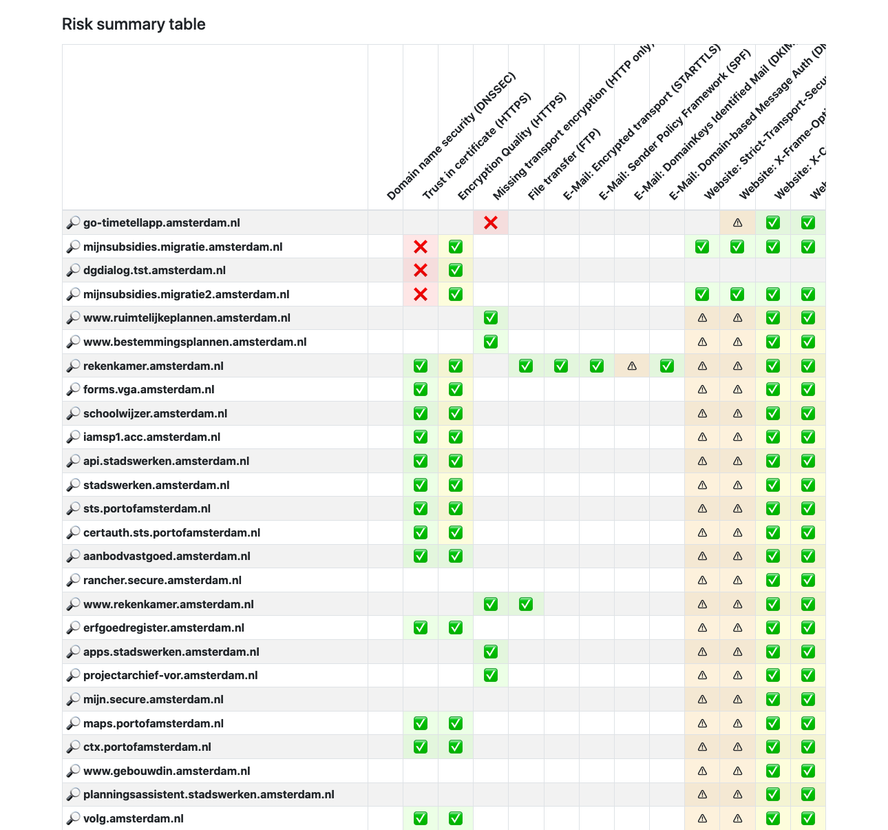
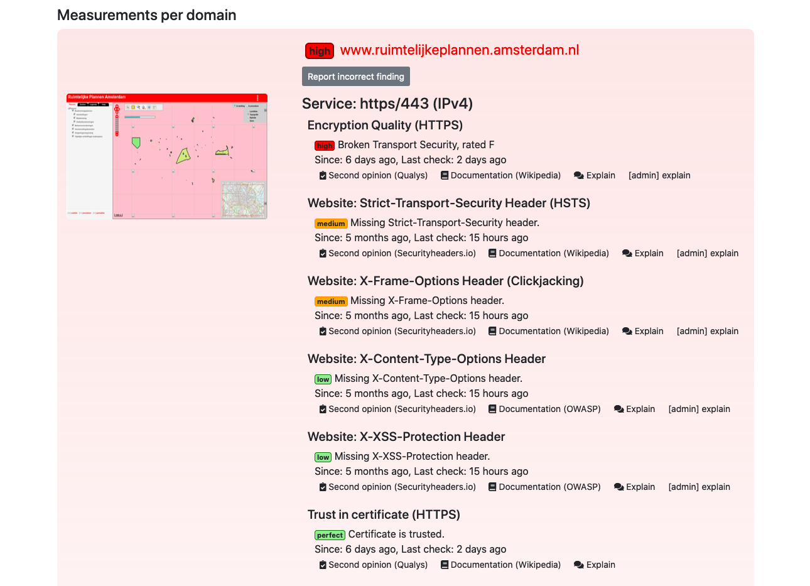
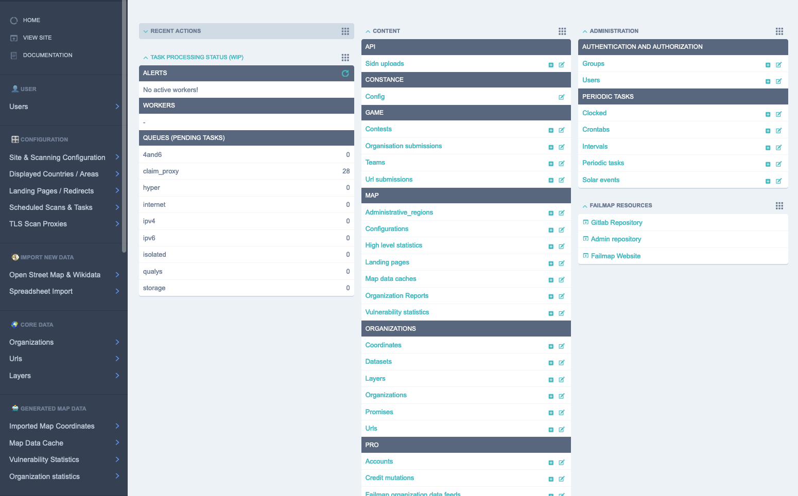

# Web Security Map

[](https://codeclimate.com/github/failmap/failmap)
[](https://gitlab.com/internet-cleanup-foundation/web-security-map/commits/master)
[](https://codeclimate.com/github/internet-cleanup-foundation/web-security-map/coverage)
[](https://shields.io)
[](https://eurocyber.nl)
[](https://gitter.im/internet-cleanup-foundation/Lobby?utm_source=badge&utm_medium=badge&utm_campaign=pr-badge&utm_content=badge)

## Why Web Security Map
Use Web Security Map to create a tangible view on how well security and privacy practices are applied.

Anyone can understand this map while stakeholders are motivated to solve issues and prove their online proficiency.

Web Security Map uses data from Open Streetmaps and Wikidata, amongst other public sources of information.

## What is it

Web Security Map is an open source web application that continuously evaluates the implementation of security standards and
best practices at (governmental) organizations.

Here is a short feature overview of what you can do with Web Security Map:


Above screenshot: map of Dutch Municipalities showing all possible issues together.


Above screenshot: map of DNSSEC issues at all Dutch government agencies. Areas and locations can be used together.



Above screenshot: statistics are kept over time, here statistics are shown for Dutch municipalities over a year.


Above screenshot: it's possible to deal with exceptional situations using "comply or explain".


Above screenshot: reporting, part 1 of 3, showing statistics for a single organization. This is the municipality of
Amsterdam.


Above screenshot: reporting, part 2 of 3, showing a summary of all urls that are scanned, with all tests.


Above screenshot: reporting, part 3 if 3, showing a detailed report of each finding, including the possibility of a
second opinion and reading documentation.


Above screenshot: the administrative interface allows direct database access as well as configuration options.

## Installation and training videos

This repository contains the front end application for Web Security Map: the map, scanners and administrative web interface. 

To run a full installation of this software, please use the below videos. 

For time indexes on these videos, visit: https://monitoryourgovernment.org/

- How To: Installation: https://youtu.be/yhx0b1k_Ag0
- How To: Import Countries: https://youtu.be/esv6G8hmwpE
- Exploring the admin interface: https://youtu.be/Yjq5klYbQww
- Configuration options: https://youtu.be/LX5_lHgljxY
- Add organizations using Data sets: https://youtu.be/YvK79QGaHTY

For all server and deployment related topics, visit: https://gitlab.com/internet-cleanup-foundation/server/


The source repository you're watching right now will only get you a development setup.


## Getting started

Keywords: quickstart, installation

### If you want a complete production setup

Then read the installation tutorial, which is significantly easier than the below development setup!

For full installation with everything and anything, check: https://gitlab.com/internet-cleanup-foundation/server/

### If you want a local test or development environment

Please follow these instructions to setup a development environment for Web Security Map:

#### Install OS specific dependencies

**macOS** via `brew`

```bash
brew install git python3 direnv docker shellcheck mysql
```

**Debian Linux** via `apt`

```bash
apt-get install -y git python3 direnv docker.io shellcheck libmariadb-dev
```

**Redhat/CentOS Linux** via `yum`

```bash
yum install -y epel-release
yum install -y git python3 direnv docker ShellCheck mysql-devel
```

Or download and install each package separately:

- [make](https://www.gnu.org/software/make/) (required, pre-installed on most systems)
- [git](https://git-scm.com/downloads) (required, download and install)
- [python3](https://www.python.org/downloads/) (required, download and install, 3.6 or higher)
- [direnv](https://direnv.net/) (recommended, download and install, then follow [setup instructions](https://direnv.net/), see Direnv section below)
- [Docker](https://docs.docker.com/engine/installation/) (recommended, follow instructions to install.)
- [ShellCheck](https://github.com/koalaman/shellcheck#installing) (recommended, follow instructions to install

#### Generic install steps

In a directory of your choosing, download the software and enter the directory:

```bash
git clone --recursive https://gitlab.com/internet-cleanup-foundation/web-security-map/ && cd web-security-map/
```

Running `make` once to create a development Virtualenv and setup the App and its dependencies. Running `make` without arguments by default also runs basic checks and tests to verify project code quality.

```bash
make
```

After completing successfully Web Security Map development server is available to run:

```bash
make run
```

Now visit the [map website](http://127.0.0.1:8000/) and/or the
[admin website](http://127.0.0.1:8000/admin/) at http://127.0.0.1:8000 (credentials: admin:faalkaart).


To fill up the empty installation with some data, use the data included with the following commands:

```bash
websecmap load_dataset development_user
websecmap load_dataset development_periodic_tasks
websecmap load_dataset development_scandata
websecmap report
```

This will provide some municipalities in the Netherlands with a report and stats.


#### Getting started with development

For development purposes it's possible to run the major components of websecmap separately, as they can be rebooted
as such. After a complete installation, use:

```bash
make run-frontend  # to run the django website
make run-broker  # to run redis (when you need to develop tasks)
make run-worker  # to run a worker that processes tasks from redis
```

Do not forget to restart your worker after altering tasks.

#### Optional Steps

If your shell support tab completion you can get a complete list of supported commands by tabbing `make`:

```bash
make <tab><tab>
```

This shows the current data on the map:

```bash
make rebuild_reports
```

It is possible to start the server without redis and without (re)loading data:

```bash
make devserver args="--no-backend --no-data"
```

Give everyone an F rating!

```bash
https://www.youtube.com/watch?v=a14Y2V5zJlY
```

```bash
https://www.youtube.com/watch?v=eAwq2QV7f1k
```

## FAQ / Troubleshooting

### Missing xcode (mac users)
During installation mac users might get the following error, due to not having xcode installed or updated.

```
xcrun: error: invalid active developer path (/Library/Developer/CommandLineTools), missing xcrun at: /Library/Developer/CommandLineTools/usr/bin/xcrun
```

You can update / install xcode tools with the following command:

```
xcode-select --install
```


Dealing with compiling mysql and other software that uses SSL.
You can look at the detailed issue here, mostly compilation fails because of a missing environment variable.

The LDFLAGS need to point to your openssl installation, for example:
 
```bash
set LDFLAGS -L/usr/local/opt/openssl/lib
```


### Missing Docker Daemon (mac users)
While docker is installed using brew in prior steps, you probably want to have
a gui controlling docker.

Docker for mac can be downloaded here:
https://download.docker.com/mac/stable/Docker.dmg

You can also visit the docker website and get the link using the time tested Oracle(tm) download strategy, here:
https://hub.docker.com/editions/community/docker-ce-desktop-mac


### Manage NPM modules for the map

npm install --prefix websecmap/map/static/js/vendor [packagename]

The --prefix is the key, and allows for multiple repositories.


## Documentation

Documentation is provided at [ReadTheDocs](http://websecmap.readthedocs.io/).

## Get involved

Internet Cleanup Foundation is open organisation run by volunteers.

- Talk to us via [gitter.im/internet-cleanup-foundation](https://gitter.im/internet-cleanup-foundation/Lobby#).
- Or using IRC: #internet-cleanup-foundation/Lobby @ irc.gitter.im (see https://irc.gitter.im for information)
- E-mail us at: [info@faalkaart.nl](mailto:info@faalkaart.nl),
- Or simply start hacking on the code, open an [Gitlab Issue](https://gitlab.com/internet-cleanup-foundation/websecmap/issues/new) or send a [Gitlab Merge Request](https://gitlab.com/internet-cleanup-foundation/websecmap.org/merge_requests/new).

## Thanks to

This project is being maintained by the [Internet Cleanup Foundation](https://internetcleanup.foundation).
Special thanks to the SIDN Fonds for believing in this method of improving privacy.

Thanks to the many authors contributing to open software.
