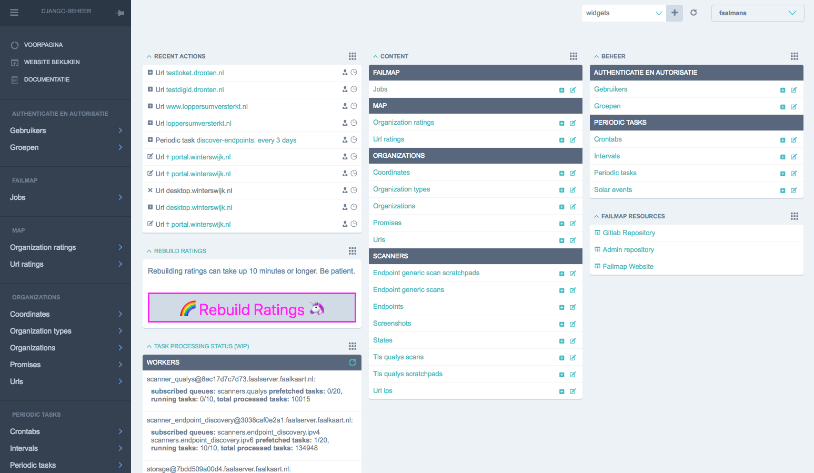

[](https://codeclimate.com/github/failmap/failmap) [](https://gitlab.com/failmap/failmap/commits/master) [](https://codeclimate.com/github/failmap/failmap/coverage)
[](https://shields.io) [](https://eurocyber.nl) [](https://gitter.im/internet-cleanup-foundation/Lobby?utm_source=badge&utm_medium=badge&utm_campaign=pr-badge&utm_content=badge)

Why Failmap
===========
We believe privacy and information integrity are the basics of a resilient information society.

By providing unprecedented transparency on the most basic levels of information security, insight in
the quality and capability of organizations regarding their responsibilities is displayed.

Failmap uses the complexity of a traffic light anyone is able to determine if organizations that are responsible
for safeguarding information are doing what they are supposed to do.

It is perfectly possible to run Failmap software for yourself, allowing you to independently verify the
state of information security basics. All our products are open source.


What is it
----------
Failmap is an open source web application that continuously evaluates the implementation of security standards and
best practices at (governmental) organizations.

This repository contains the mapping application fo Failmap: the public frontend, an administrative interface and scanners.





Getting started
===============
Keywords: quickstart, installation
## 1: Install dependencies on your system
Setup your system to run this software using your favourite package manager.

**MacOS (brew)**
```bash
brew install git python3 direnv
```

**Debian Linux (apt)**
```bash
apt-get install git python3 direnv
```

**Redhat/CentOS (yum)**
```bash
yum install git python3 direnv
```

Or download and install each package separately:

- [git](https://git-scm.com/downloads) (download and install)
- [python3.6](https://www.python.org/downloads/) (download and install)
- [Tox](http://tox.readthedocs.io/) (`pip3 install --user tox`)
- [direnv](https://direnv.net/) (download and install, then follow [setup instructions](https://direnv.net/), see Direnv section below)
- [Docker](https://docs.docker.com/engine/installation/) (recommended, follow instructions to install.)

## 2: Install direnv correctly
Then set up direnv, the right command depends on your shell:

**BASH**
Add the following line at the end of the ~/.bashrc file:
```bash
eval "$(direnv hook bash)"
```

Make sure it appears even after rvm, git-prompt and other shell extensions that manipulate the prompt.

**ZSH**
Add the following line at the end of the ~/.zshrc file:
```bash
eval "$(direnv hook zsh)"
```

**FISH**
Add the following line at the end of the ~/.config/fish/config.fish file:

```bash
eval (direnv hook fish)
```

**TCSH**
Add the following line at the end of the ~/.cshrc file:

```bash
eval `direnv hook tcsh`
```


## 3: Generic install steps
Install Tox, which helps to install the rest of the dependencies of this project:

```bash
pip3 install --user tox
```

In a directory of your choosing:

download the software

```bash
git clone --recursive https://gitlab.com/failmap/failmap/
```

enter the directory of the downloaded software

```bash
cd failmap/
```

This prepares the shell environment for local development.

```bash
direnv allow
```

Running Tox once creates a development Virtualenv in .tox/default/ which is automatically used after creation due to Direnv setup. Running Tox without arguments by default also runs basic checks and tests to verify project code quality.

```bash
tox
```

After completing successfully Failmap is available to run. For example, to show a list of commands:

```bash
failmap help
```
Now run the following command to start a full development server.

```bash
failmap devserver
```

Now visit the [map website](http://127.0.0.1:8000/) and/or the
[admin website](http://127.0.0.1:8000/admin/) at http://127.0.0.1:8000 (credentials: admin:faalkaart).

## 4. Optional Steps
This shows the current data on the map:

```bash
failmap rebuild_ratings
```

It is possible to start the server without redis and without (re)loading data:

```bash
failmap devserver --no-backend --no-data
```


Give everyone an F rating!

```bash
https://www.youtube.com/watch?v=a14Y2V5zJlY
```

```bash
https://www.youtube.com/watch?v=eAwq2QV7f1k
```


Documentation
=============
Documentation is provided at [ReadTheDocs](http://failmap.readthedocs.io/).

Get involved
============

Failmap is open organisation run by volunteers.

- Talk to us via [gitter.im/internet-cleanup-foundation](https://gitter.im/internet-cleanup-foundation/Lobby#).
- Or using IRC: #internet-cleanup-foundation/Lobby @ irc.gitter.im (see https://irc.gitter.im for information)
- E-mail us at: [info@faalkaart.nl](mailto:info@faalkaart.nl),
- Or simply start hacking on the code, open an [Gitlab Issue](https://gitlab.com/failmap/failmap/issues/new) or send a [Gitlab Merge Request](https://gitlab.com/failmap/failmap.org/merge_requests/new).

Thanks to
=========
This project is being maintained by the [Internet Cleanup Foundation](https://internetcleanup.foundation).
Special thanks to the SIDN Fonds for believing in this method of improving privacy.

Thanks to the many authors contributing to open software.
