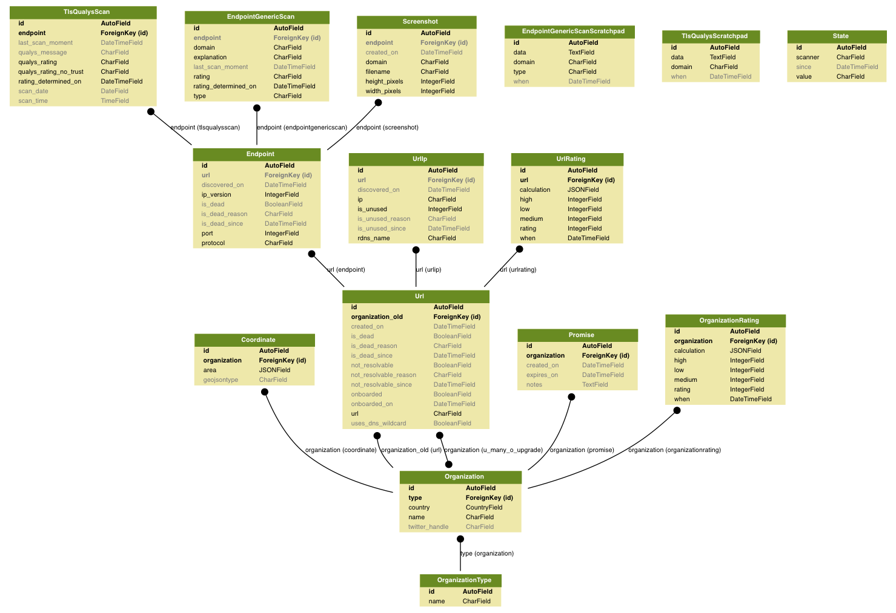

# Writing a scanner
Scanners are what make up the reporting of Failmap.

## Basic scanning requirements
Make sure your scanner complies to this small set of basic requirements:

Do not cause operational interference at scanned parties: A scan is ...
- short and doesn't keep connections open,
- low in traffic,
- compliant with common sense computer laws,

Furthermore, a scan is...

- only about risks that can be published without further risk to society. As such you cannot scan things that can be
easily exploited such as SQL injections or unauthenticated services. While in the end
organizations are responsible for proper security, our mission is to make the world a safer place. If you find something
scary, please do a responsible disclosure. We can help you point to the right organization to do so.
- aware that everything on any layer can fail: network, the server implementation, and anything else
- a task that is run from a server somewhere in the world
- able to perform in random order
- only requesting a minimum set of ports: portscans are usually deterred anyway, so don't bother.
- should not require manual operation

Lastly:

- Do not ever try to authenticate to any service you're not explicitly allowed for: that is illegal here and
can be seen as an attack.


## Getting Coding
Failmap is written in Python. Easiest for everyone is to use dependencies that are in Python modules or standalone code.


### Creating a new scanner and scanner command
Scanners are located here:
```
/failmap/scanners/scanner_*.py
```

Additionally a commandline command to run the scanner is stored here. This command is instantly callable
via the failmap command line tool. This might help development a bit.

```
/failmap/scanners/management/commands/scan_*.py
```

### Example and dummy implementation
In the scanners directory there are example scanners that help you. Steal code from them.

If you like to think abstract, start with scanner_dummy.py. If you're more into copy-pasting and looking
at practical implementations, look around in the other scanners.

```
/failmap/scanners/scanner_dummy.py
```


### Storing results
The dummy shows that it's easy to store information on endpoints. A result is stored as a value and a message
that explains how the value was discovered. Using EndpointScanManager only new / changed results are stored. This
saves a lot of data, as your scan will be run every day.

Depending on "how common" the vulnerability is you're scanning, it might be wise to evaluate:


A) Should the first result always be stored, and then the status in the future be tracked,

| OR

B) Should the first result only be stored if something is wrong, and then track the status in the future,

| OR

C) Not store the result at all (in case of high risk vulnerabilities, such as unauthenticated services etc) - But to
ask about the responsible disclosure mailbox / procedure.

The usual pattern is A.

EndpointScanManager can only store a single status and track it over time. Would you want to create your own Django
Model for storing results. The Django documentation about it's [ORM](https://docs.djangoproject.com/en/2.0/topics/db/queries/)  and [models](https://docs.djangoproject.com/en/2.0/topics/db/models/) is excellent.

This is the Failmap data model:



### Writing and admin action

Todo.


### Make sure it's used on the map
Failmap uses a process of "building ratings". This is a cache of all discovered findings, so the map can
quickly query the current state. Ratings are in sequential order and built frequently.

To get a rating on the map, add your scanner type to the below file at lines X, Y and Z. This is very
easy if you use EndpointGenericScan.

```
/failmap/map/rating.py
```

Then you have to determine the severity of your discovery. The choice is yours if it counts for high,
medium and low. Add your scanner to the below file:

```
/failmap/map/points_and_calculations.py
```

and impelent the routine that returns a result. Note that we're phasing out the "points" field.


### Translate the results
We're using some trickery to translate your results. To do so, add your messages and their translations
to the following file:

```
/failmap/map/static/js/script.js
```

Then run

```
failmap translate
```

Go to the translations dir and translate to the correct languages. This should be at least rainbowsandunicorns to
test your messages. Then use a language of your choice and capability.

Translation files are here:

```
/failmap/map/locale/*/djangojs.po
/failmap/map/locale/*/django.po
```

after editing again run

```
failmap translate
```


## Additional how to's:

### Storing temporary files
As you don't know where files will be located, add paths to the django settings file. This is located at:

```bash
/failmap/settings.py
```

there modify the TOOLS variable to add your tool/scanner:

```python
TOOLS = {
    'yourtool': {
        'executable': VENDOR_DIR + os.environ.get('YOURTOOL_EXECUTABLE', "yourtool/yourtool.py"),
        'output_dir': OUTPUT_DIR + os.environ.get('YOURTOOL_OUTPUT_DIR', "scanners/resources/output/yourtool/"),
    },
```

in your module, you can import these like this:

```python
from django.conf import settings
youtool = settings.TOOLS['youtool']['executable']
```
